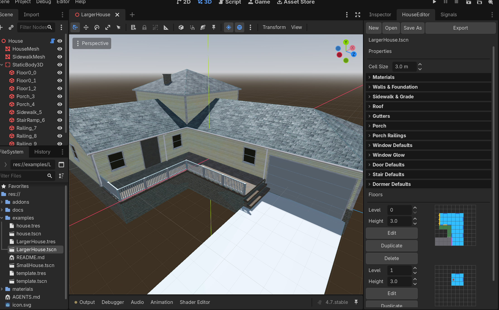
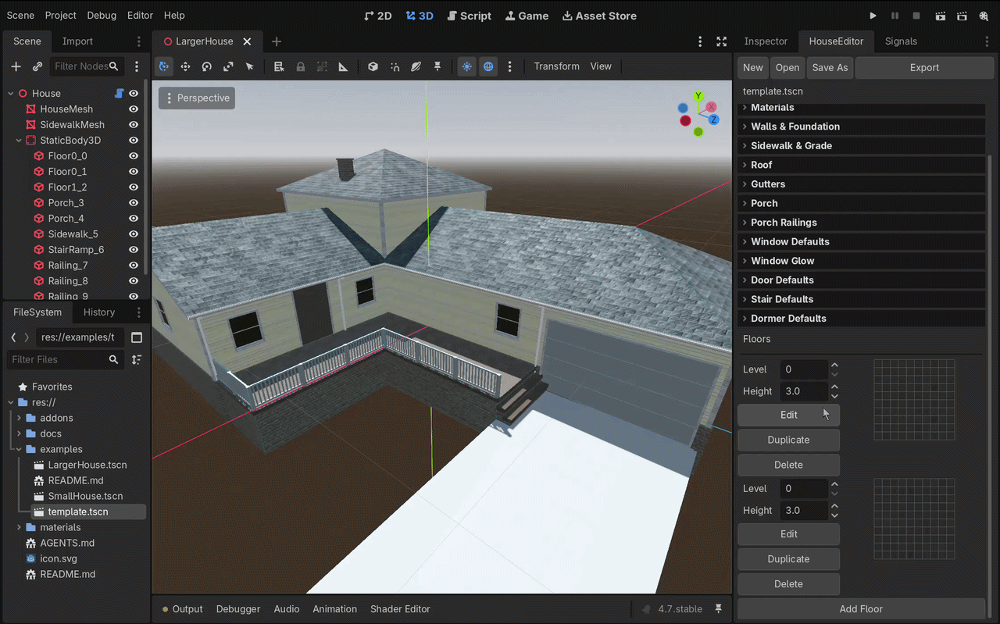
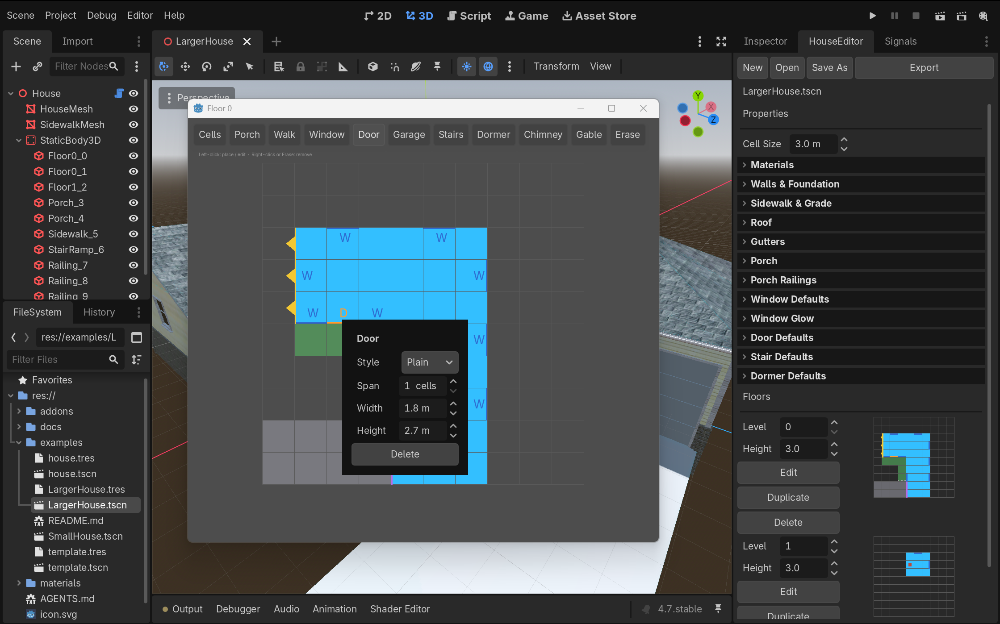

# House Builder

A Godot 4.7 editor plugin for designing houses on a grid and generating the
exterior shell as a real mesh — foundation, walls, trim, roof, porch, and
details — then exporting each house as a ready-to-instance scene.

You paint cells on a per-floor grid, drop windows and doors onto wall edges,
and the plugin builds the geometry. Roofs come from a straight-skeleton solver,
so hips, ridges, and valleys resolve correctly on any footprint you paint,
including L-shapes and multi-storey setbacks.



---

## Features

- **Grid-based floor plans** — paint occupied cells per floor, floors stack by level
- **Procedural exterior shell** — foundation, siding walls, corner trim, roof
- **Straight-skeleton roofs** — hips, ridges, valleys and eaves on arbitrary
  footprints, with a flat-cap fallback when a footprint can't be solved safely
- **Multi-storey roofs as one system** — the lower roof generates across the whole
  floor, then the upper storey's footprint is subtracted out, rather than stacking
  independent hip roofs per step
- **Gable ends** — mark any exterior wall run as a gable; gets a siding gable,
  sloped rake boards, and a rake soffit that tiles into the neighbouring eave soffit
- **Wall details** — windows, doors, and garage doors placed on cell edges, or
  dragged across a run of edges for wide garages and picture windows
- **Porches** — deck, posts, railings (picket / horizontal / cross-slat infill),
  descending stairs, and a flat ceiling. A roofed porch has no roof of its own:
  its cells join the main roof footprint so the eaves wrap it seamlessly
- **Dormers and chimneys** — sit on the generated roof surface, queried from the
  real roof model rather than re-deriving the pitch
- **Gutters and downspouts** — generated automatically along the lowest roofed
  level's eaves and run down to grade
- **Sidewalks and driveways** — painted as their own cells, exported as a separate
  mesh so they never merge into the house
- **Window glow** — exported houses carry a `windows_lit` toggle that swaps the
  glass surface to a lit material. Purely graphical, no light nodes
- **Primitive collision** — exported houses get box shapes derived from the house
  data
## Requirements

- **Godot 4.7** or newer

## Installation

**As a project to explore:**

```bash
git clone https://github.com/IsaacPrice/godot-house-model-generator.git
```

Open the folder in Godot. The plugin is already enabled; the **House Builder**
dock appears on launch.

**As an addon in your own project:**

Copy `addons/house_builder/` into your project's `addons/` folder, then enable
**House Builder** under *Project → Project Settings → Plugins*.

If you plan to use exported houses at runtime, `addons/house_builder/runtime/`
must ship at the same `res://` path — that's where the window-glow script lives.
Nothing else in the addon is needed at runtime.

## Usage

### 1. Paint a floor plan

Select the **Cells** tool and click grid cells to occupy them. Each cell is
`level_cell_size` meters square (2 m by default). Add floors from the Floors
panel; each floor has its own level and height.




### 2. Place details

Pick a tool — **Window**, **Door**, **Garage**, **Stairs**, **Dormer**,
**Chimney**, or **Gable** — and click a cell edge.

| Action | Result |
| --- | --- |
| Left-click empty edge | Place the active detail on that one cell |
| Drag across wall edges | Place a detail spanning the whole run — this is how wide garage doors and picture windows are made |
| Left-click existing detail | Open its inspector (style, size, sill height) |
| Right-click, or the Erase tool | Remove the detail under the cursor |
| **Edit** button | Open the current floor in a larger resizable window |

The full tool list is **Cells**, **Porch**, **Walk**, **Window**, **Door**,
**Garage**, **Stairs**, **Dormer**, **Chimney**, **Gable**, and **Erase**.
Porch, Walk, Door, Garage, and Stairs apply to the lowest floor only and are
disabled elsewhere. Each floor also has **Duplicate** and **Delete** buttons.

Details are addressed by cell edge and are never auto-pruned. If you erase a cell
underneath one, it turns red in the grid and is skipped at build time until you
remove it.



### 3. Tune the house

The **House Properties** panel holds every material slot and geometry constant:
wall thickness, roof pitch, overhang, fascia height, foundation mode, railing
style, baluster spacing, and so on. All of them are `@export` properties on
`HouseData` with inspector tooltips.

### 4. Save and export

Saving *is* exporting. A saved house is a single `.tscn` containing the
instantiable scene with the editable `HouseData` embedded as metadata on the root
node, so one file is both your editable source and the prefab you drop into a
level. `Ctrl+S` quick-saves.

The exported scene looks like this:

```
House (Node3D)
├── HouseMesh (MeshInstance3D)        one surface per material slot
├── SidewalkMesh (MeshInstance3D)     only if sidewalk cells were painted
└── StaticBody3D
    ├── Floor0_0 (CollisionShape3D)   box shapes derived from house data
    ├── Porch_2  (CollisionShape3D)
    └── ...
```

Houses with glass also get the `HouseWindowLights` script on the root:

```gdscript
$House.windows_lit = true   # swaps the glass surface to the lit material
```

## Examples

`examples/` contains three test houses, including a two-storey house with a
porch, dormers, chimney, gutters, and a driveway. Open any of them through the
dock's **Open** button. See [examples/README.md](examples/README.md) for what
each one covers.

These are development fixtures rather than finished art — they exist so the tool
has something to open and so the save/load format stays exercised.

## Project layout

```
addons/house_builder/
  house_builder.gd      EditorPlugin entry point
  data/                 HouseData, FloorData, WallDetail, dormer/chimney/gable resources
  mesh/                 the mesh generation pipeline
    builders/           wall, foundation, trim, porch, sidewalk, dormer, chimney, roof glue
    details/            wall openings, window/door/garage dressing, placement rules
    roof/               pure-geometry roof subsystem (straight skeleton, generator, gutters)
  runtime/              window-glow toggle; the only non-editor code
  ui/                   the dock: house properties, floors, level editor, grid editor
  tests/                seven headless suites
docs/                   architecture notes and images
examples/               sample houses
materials/              PBR material resources
```

See [docs/ARCHITECTURE.md](docs/ARCHITECTURE.md) for how the subsystems fit
together and why the roof is decoupled from the grid data model.

## Status

Working and in active use, but pre-1.0 — the save format and export scene layout
may still change. Bug reports and questions are welcome via issues.

## License

Code is [MIT](LICENSE).

Textures in `materials/` are from [ambientCG](https://ambientcg.com/) and are
released under [CC0 1.0](https://creativecommons.org/publicdomain/zero/1.0/).
They carry no attribution requirement and can be used freely.
